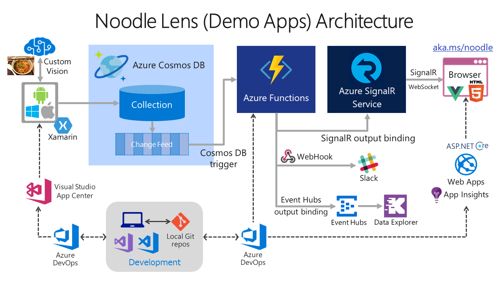
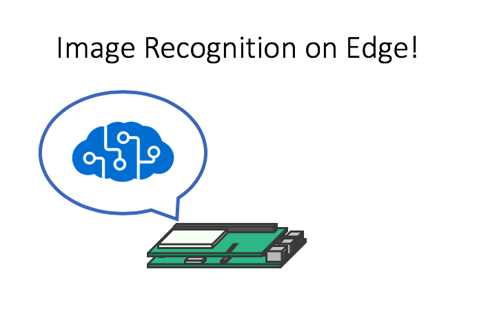

[Link to this GitHub Repo](http://github.com/drewby/ts18dev)

# Demo 1 - Cosmos DB, Azure Functions and SignalR

* Noodle Lens Result Monitor: [aka.ms/noodle](https://aka.ms/noodle)

# Demo 2 - Java DevOps with Visual Studio Code & Azure DevOps

* [Abstract of this Demo by Japanese](./demo2/demo2.md)

# Demo 3 - ML on Edge CI/CD

# Demo 4 - Xamarin, .NET Standard, App Center

This demo app SmartHotel360 is all on GitHub so you can get it today: [Github.com/Microsoft/SmartHotel360](https://github.com/Microsoft/SmartHotel360).

You can also get the whole demo script here: [Github.com/chomado/GS02-DemoScript](https://github.com/chomado/GS02-DemoScript/blob/master/doc.md).

↓ This app's whole architecture is as below, but in this demo part (only 10-15 min), we'll show Xamarin client part and ASP.NET Core part in this picture.

