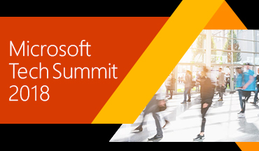
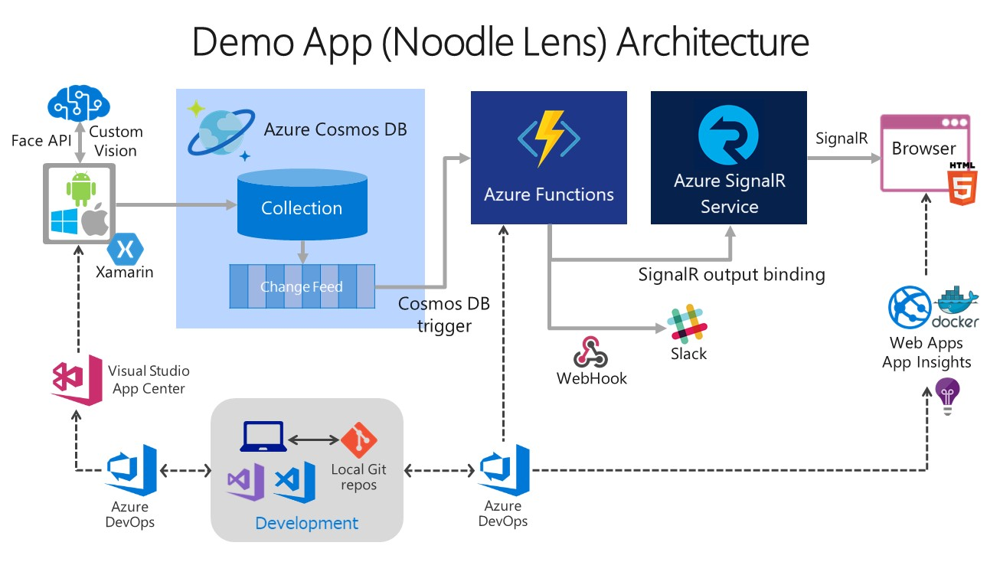
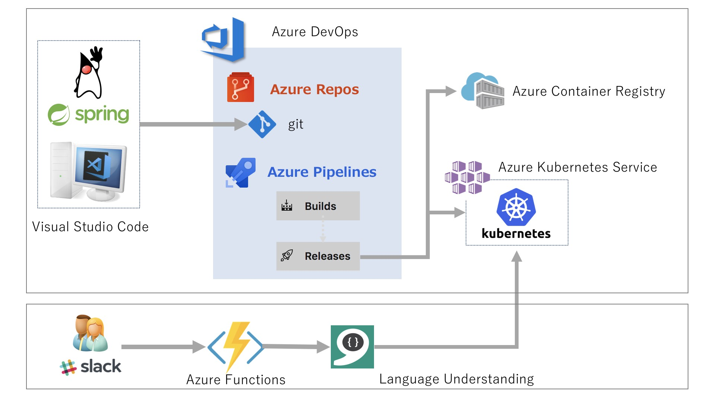
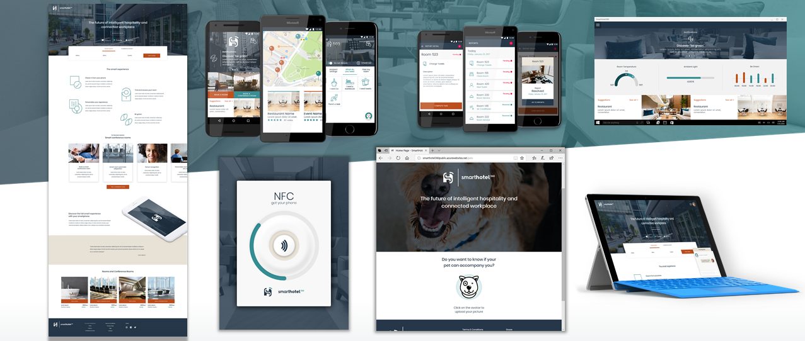
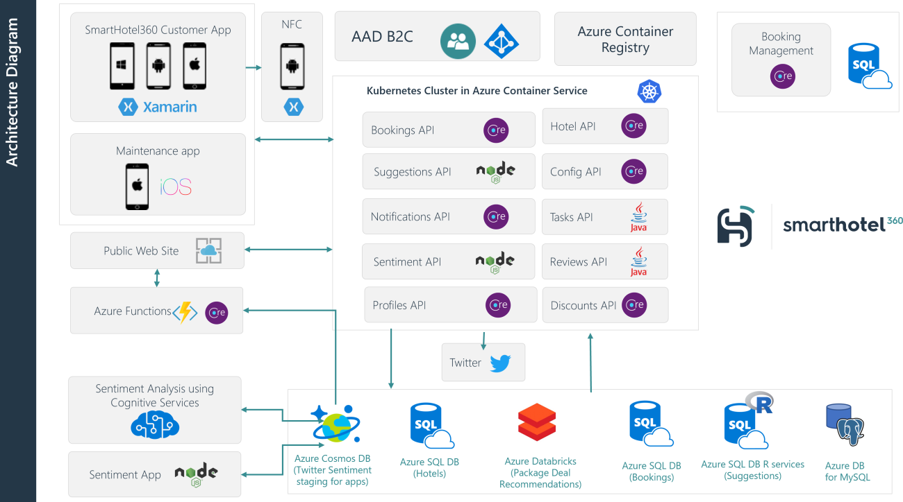

# Demo 1 - Cosmos DB, Azure Functions and SignalR

* Noodle Lens Result Monitor: [aka.ms/noodle](https://aka.ms/noodle)

# Demo 2 - Java DevOps with Visual Studio Code & Azure DevOps

# Demo 3 - ML on Edge CI/CD

# Demo 4 - Xamarin, .NET Standard, Docker

This demo app SmartHotel360 is [all on GitHub](https://github.com/Microsoft/SmartHotel360) so you can get it today.

↓ This app's whole architecture is as below, but in this demo part (only 10min) we'll show Xamarin client part and ASP.NET Core part in this picture.

